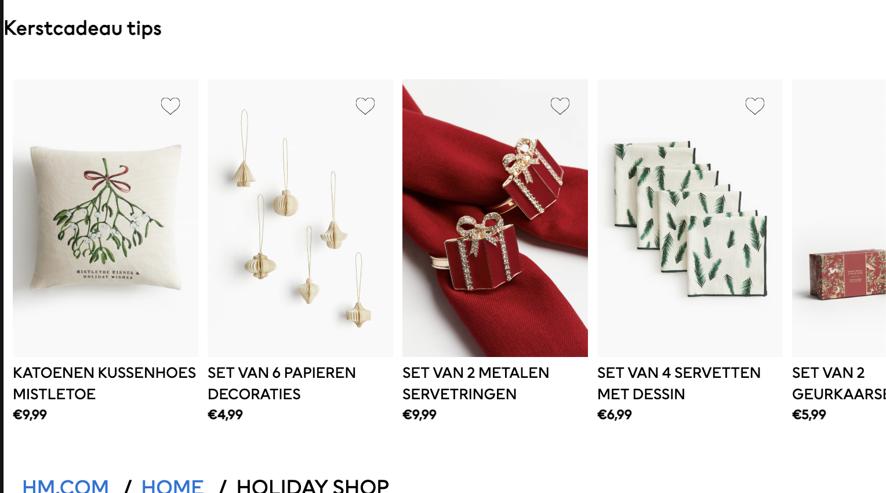

# Procesverslag
Markdown is een simpele manier om HTML te schrijven.  
Markdown cheat cheet: [Hulp bij het schrijven van Markdown](https://github.com/adam-p/markdown-here/wiki/Markdown-Cheatsheet).

Nb. De standaardstructuur en de spartaanse opmaak van de README.md zijn helemaal prima. Het gaat om de inhoud van je procesverslag. Besteedt de tijd voor pracht en praal aan je website.

Nb. Door *open* toe te voegen aan een *details* element kun je deze standaard open zetten. Fijn om dat steeds voor de relevante stuk(ken) te doen.

## Jij

  
uitwerken voor kick-off werkgroep

  ### Auteur:
  Femma Ghabri

  #### Je startniveau:
  Blauw

  #### Je focus:
  Extra aandacht voor de surface plane
 

## Je website

  
uitwerken voor kick-off werkgroep

  ### Je opdracht:
  https://www2.hm.com/nl_nl/home.html

  #### Screenshot(s) van de eerste pagina (small screen): 
  H&M home startpagina 
[Bekijk PDF versie hier! + eerste ideeën](https://drive.google.com/file/d/1GDc4-l4XxLxt8VOs-bTAlNyUdu3FQbwe/view?usp=sharing)

  #### Screenshot(s) van de tweede pagina (small screen):
  H&M home 'gifts' pagina 
 [Bekijk PDF versie hier! + eerste ideeën](https://drive.google.com/file/d/1dEBQJww-G3-C6ucowxvknZjJIk5mR6O5/view?usp=sharing)

## Toegankelijkheidstest 1/2 (week 1)

  
uitwerken na test in 2e werkgroep

  ### Bevindingen
  Lijst met je bevindingen die in de test naar voren kwamen:

  kijk bij toegankelijkheidstest 2/2 voor foto's van de WCAG checklist!!!

  1- veel opmerkingen (bij foutmeldingen).
  2- ontzettend veel css code. 
  3- niet elk onderdeel wordt ondersteunt voor keyboard-focus.
  4- afbeeldingen zijn enorm groot op mobiel.
  5- hierarchie klopt niet, begint gelijk vanaf h2. ook missen er specifieke namen bij de headings. code bestaat nu uit random nummers en letters.
  6- list namen ook vaag.
  7- de items die te koop zijn hebben duidelijke alt teksten. de grote foto's aan het begin van de pagina missen deze.
  8- de tekst op de foto's staat nog niet in de alt tekst.
  9- er zijn nog geen filmpjes. deze wil ik van hun instagram halen en toevoegen.
  10- nog niet elke link ziet er uit als een link (streepje eronder).
  11- skiplink ontbreekt.
  12- er is geen darkmode beschikbaar.

## Breakdownschets (week 1)

  
uitwerken na afloop 3e werkgroep

  ### de hele pagina: 
  

  ### form: 
  

## Voortgang 1 (week 2)

  
uitwerken voor 1e voortgang

  ### Stand van zaken
  ik heb mijn html soort van af. de breakdown schets ook. ik vind het allemaal een beetje overweldigend.

  ### Agenda voor meeting
  samen met je groepje opstellen

  Romy: 
  -hoe zit het met divs? wat valt daaronder?
  
  Femma:
  -als mijn site zowel nederlandse als engelse teksten bevat, welke taal instellen?
  -wanneer gebruik je grids en wanneer gebruik je flexbox?

  Nina:
  -ik wil mijn site mooier maken maar is dat wel de opdracht?

  ### Verslag van meeting
 het gesprek heeft mij echt enorm geholpen. ik heb mijn vragen kunnen stellen en extra uitleg gekregen over articles, sections en divs. ook hebben we gekeken naar de site van romy en deze helemaal samen ontleedt. wat heeft geleid tot interessante inzichten. zo wist ik niet dat een logo ook een h1 kan zijn en dat je links moet stijlen als een button als ze leiden naar andere pagina's. 

## Voortgang 2 (week 3)

  
uitwerken voor 2e voortgang

  ### Stand van zaken
na flink wat moeite en verschillende bronnen te hebben raadgepleegd (lees; wc3 school, student assistent en de lessen) heb ik de header/nav af. 

  ### Agenda voor meeting
  Femma- mag ik toch nog switchen naar responsive? mogen linkjes ook naar niks leiden (als in puur voor de vorm)? Hoe fotos bij productpagina?
  Romy- vragen over de product pagina.
  Nina- hoe zit het met css op de tweede pagina? hulp nodig bij knop van youtube filmpje.
  Susan- Vragen over svg, list items.

  ### Verslag van meeting
  hier na afloop snel de uitkomsten van de meeting vastleggen

  - student assistente wijst me op mijn headings. ik moet daar nog een keertje nakijken. wat kan een p worden? wat kan een h2 blijven?
  - aan leraar vragen of ik mag switchen naar responsive maken van website.

- ik ga me toch focussen op het responsive ontwerpen!

## Toegankelijkheidstest 2/2 (week 4)

  
uitwerken na test in 9e werkgroep

 

  

   

  

  

  ### Bevindingen
  Lijst met je bevindingen die in de test naar voren kwamen (geef ook aan wat er verbeterd is):
  1. Alle afbeeldingen en buttons hebben nu een alt.
  2. Ik heb een video toegevoegd met controls.
  3. Alle links zien er nu klikbaar uit.
  4. Mijn html is valid.
  5. De hierarchie is een stuk netter.
  6. Ik moet nog even kijken naar focus states!

## Voortgang 3 (week 4)

  
uitwerken voor 3e voortgang

  ### Stand van zaken
  Ik ben flink bezig geweest met de site afronden. Het gaat nu vooral om het 
  checken van mijn codes en de laatste dingen aanvullen. Mijn tweede pagina
  moet ik nog responsive maken, mijn form moet ik nog wat toegankelijker maken en de laatste dingen moet ik nog even aanpassen.

  

  

  

  ### Agenda voor meeting
  Femma- wanneer een alt en wanneer een aria-label?

  Romy- vragen over mooier maken van de site, vragen over alt teksten.

  Nina- hoe zit het met pixels en ems?, aria-labels hidden foutmeldingen.

  Susan- vragen over herkansen.

  ### Verslag van meeting
  We zijn allemaal goed op weg.

  - Er bestaan geen domme vragen!
  - Foto's krijgen altijd een alt. Aria labels gebruik je echt alleen als het niet anders kan.

## Eindgesprek (week 5)

  
uitwerken voor eindgesprek

  ### Je uitkomst - karakteristiek screenshots:
  

   

  ### Dit ging goed/Heb ik geleerd: 
  Ik ben trots dat ik heb geleerd hoe je elementen kunt schalen met media queries! 
  Ook het kopje 'Kerstcadeau tips' die ik heb gemaakt met de hulp van de student assistent vind ik er heel professioneel uitzien. Ik heb deze afgelopen weken ontzettend veel handige sites, shortcuts, trucjes en nieuwe manieren van code schrijven geleerd. 
  
  
  
  

  ### Dit was lastig/Is niet gelukt:
  Ik zou nog een skip link toevoegen. Ik was er wel mee begonnen maar het is me helaas niet gelukt. Ook zou ik het formulier verder willen uitbreiden met bijvoorbeeld een 'date of birth' of een checkbox met 'ik ga akkoord met de voorwaarden' waar ik wel trots op ben is het :user-invalid stukje! Daarnaast had ik heel graag de 2e pagina wat complexer willen maken. Zowel bij de vormgeving (animaties) als de responsiveness (andere layout als het scherm groter wordt). 

  
    

## Bronnenlijst

  
continu bijhouden terwijl je werkt

  Nb. Wees specifiek ('css-tricks' als bron is bijv. niet specifiek genoeg). 
  Nb. ChatGpT en andere AI horen er ook bij.
  Nb. Vermeld de bronnen ook in je code.

  1. https://www.onlinewebfonts.com/download/70f3e46b3bb904260d1b1a6e0f2edf08 voor mijn font
  2. https://www.google.com/url?sa=i&url=https%3A%2F%2Fcommons.wikimedia.org%2Fwiki%2FFile%3AHM-Logo.png&psig=AOvVaw3F4DrMMU6J_4l8uLAiUNs3&ust=1732124581731000&source=images&cd=vfe&opi=89978449&ved=0CBQQjRxqFwoTCLiA44T56IkDFQAAAAAdAAAAABAJ voor fav icon
  3. https://www2.hm.com/nl_nl/home/holiday/holiday-shop.html en https://www2.hm.com/nl_nl/productpage.1248997001.html vor al het beeldmateriaal
  4. https://developer.mozilla.org/en-US/docs/Web/HTML/Element/details uitleg over details en summary
  5. https://www.w3schools.com/howto/howto_css_breadcrumbs.asp uitleg over breadcrumbs
  6. student assistentes en klasgenoten 
  7. https://css-tricks.com/html-inputs-and-labels-a-love-story/ uitleg over forms en labels clickable maken
  8. https://www.w3schools.com/howto/howto_css_hide_scrollbars.asp uitleg over hoe ik de scrollbar weghaal in de zwarte nav
  9. https://developer.mozilla.org/en-US/docs/Web/CSS/:user-invalid uitleg over input invalid bij formulier
  10. ChatGPT prompt= "Is mijn html goed geschreven?" als final check.

